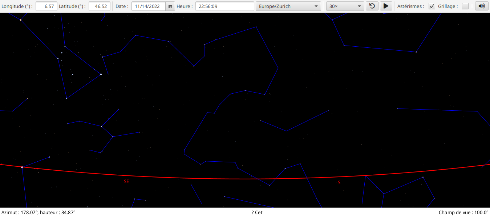
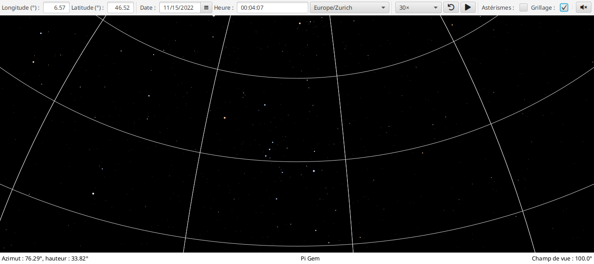

# Rigel - Night Sky Visualization Program

## Presentation

This project was realized in the context of the Object-Oriented course at EPFL. It implements a **JavaFX** application that allows users to visualize the sky at night.

Rigel models all visible celestial objects at any *location*, *orientation*, and *time* on Earth.

This work was carried out in collaboration with Paul Guillon, undergraduate student at EPFL (paul.guillon@epfl.ch).

## Build

This work is coded in Java and uses Maven to sort out the required dependencies. No special actions are required to launch the app.

## Use

Rigel includes several features listed below.

- *Direction keys* adapt the orientation.
- *Scrolling* allows to zoom in or out.
- The *play* button emulates the evolution of the sky over time. 
- *Boxes* can be used to change the date or position on Earth.
- *Checkboxes* show or hide the constellations and meridian lines.

## Screenshots

Here are some images that showcase Rigel.

  

  

